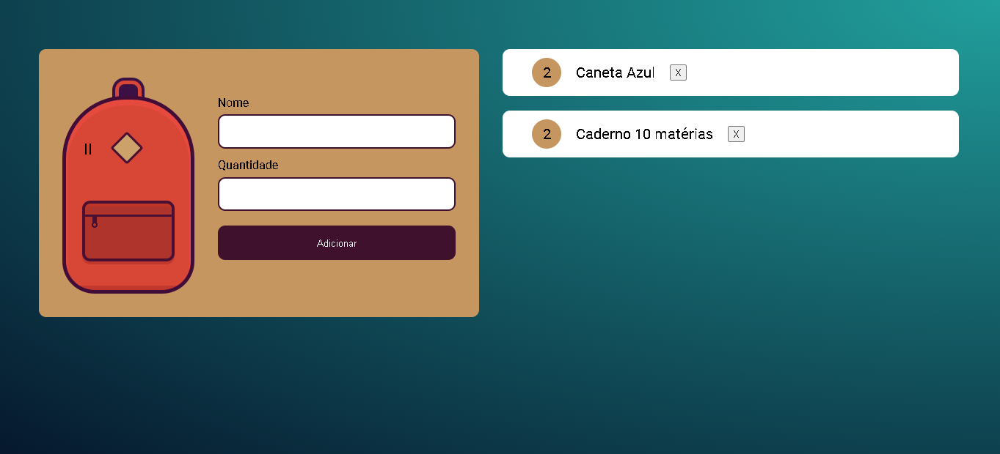

<h2 align="center">
  Challenge usando LocalStorage 
  <a href="https://edson-araujo.github.io/challenge-LocalStorage-Alura/" target="_blank">Acesse</a>
</h2>

  

 

## Desenvolvido com
Esse projeto foi desenvolvido com as seguintes tecnologias

- HTML5
- CSS3
- JavaScript

## Features

**📖 CRUD simples**

**📱 Salvamento no LocalStorage**
